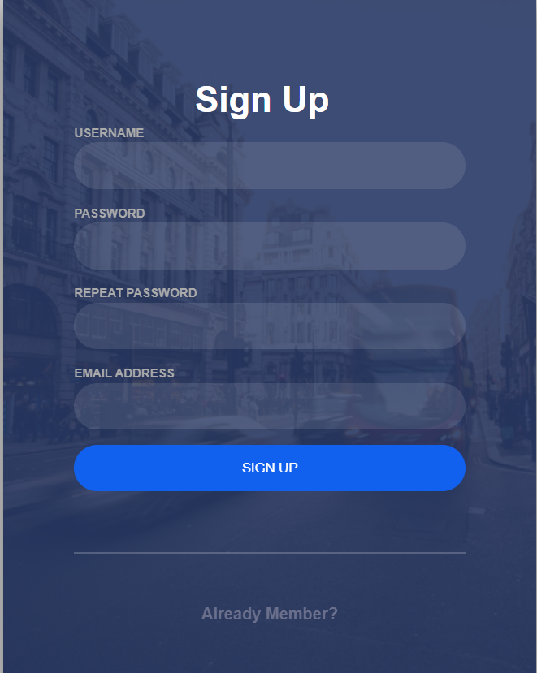

# CNT_HW2
I did my homework 2 by writing a web application with features like authentication that allows users to log in and redirects to a profile page for each user, allowing users to create accounts and the profile will be displayed with data related to each account. Implemented password hashing using Bcrypt and allowed logout to change password, also the site allows users to update their profile information and avatar. All data is stored in Mongodb.
## Basic part:
Implement authentication feature   
### 1.1 Listen on localhost:5000 
The Flask application listens on port 5000, serving as the entry point for users.
### 1.2 Render authentication form at http://localhost:5000/  
At http://localhost:5000/ the website will send a login form asking the user to authenticate his account. 
  
### 1.3 Redirect user to profile page if successfully authenticated 
Upon successful authentication, users are redirected to their profile page
### 1.4 Show profile page for authenticated user only at http://localhost:5000/profile   
If the user authenticates successfully, the site will be redirected to the profile page at http://localhost:5000/profile.  
  
### 1.5 User name and password are stored in Mongodb or Redis
User data is stored using mongodb. 
  
## Advanced part (optional):   
### 2.1 Implement feature that allows users to create new account, profile will be shown with data respected to each account.  
On the login page, if the user does not have an account, they can click Sign Up to create a new account, the website will redirect to the sign up page. After completing the account registration, the user needs to log in to the newly created account. If successful, they will be redirected to the profile page of that account. 
  
### 2.2 Implement password hashing, logout and password change features 
* Password hashing is done using bcrypt. 
hashed_password = bcrypt.generate_password_hash(new_password).decode('utf-8')
* User logout feature can click this button on the profile page. 
  
* User change password feature click this button on the profile page, then the website is redirected to the password change page where the user can change the password and update his password. After successful the user needs to log in again to enter the profile page. 
  
### 2.3 Allow users to update profile picture (new user will have a default profile picture) 
Users can update their avatar on the edit_profile page, otherwise it will be uploaded by default when entering the profile page. 
* Personal page without updated information and avatar. 
  
* Image update code.  
  
### 2.4 Allow users to update profile information
Users can update profile information at edit_profile page. 
  

## Technologies used
* HTML/CSS: For the frontend interface.
* Flask: A web application framework used for backend processing.
* MongoDB: A NoSQL database for storing user and session data.
* Flask-Bcrypt: For securely hashing passwords.
* Session: Used to store and manage user information when logging into the website.
* JavaScript: Performs some user interaction functions.
  
## How to run
1. Clone the Repository:
git clone https://github.com/itmo-wad/CaoNgocTuan-hw2.git
2. Navigate to the Project Directory:
cd [project directory name]
3. Install Dependencies:
pip install Flask pymongo bcrypt
4. Database Setup:
Ensure MongoDB is running on your local machine
5. Run the Application:
py app.py
6. Access the application: Open your web browser and navigate to http://localhost:5000 (or the address shown in terminal).
